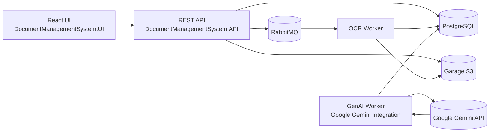
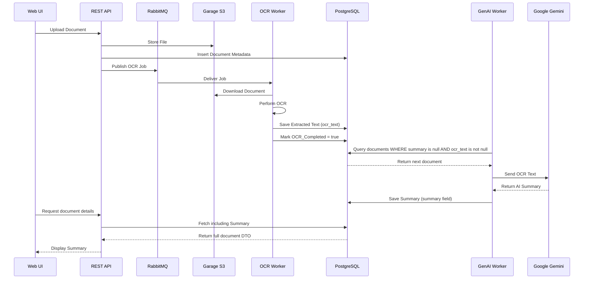

# Projekt-Dokumentation - DocumentManagementSystem

## Architektur-Entscheidungen

### Backend (.NET 8, ASP.NET Core)
- **.NET 8 & C#**: Moderne, performante Plattform mit guter Unterstützung für Web-APIs, Entity Framework und Docker. Team-Expertise vorhanden.
- **Code-First REST API**: Endpunkte werden im Team abgestimmt und direkt im Code definiert. Das ermöglicht schnelle Iteration und Anpassung.
- **Repository-Pattern & ORM (EF Core)**: Trennung von Business-Logik und Datenzugriff, bessere Testbarkeit und Wartbarkeit. PostgreSQL als DB wegen Stabilität und Open-Source.
- **Unit-Tests mit Mocking**: xUnit und Moq, produktive DB wird für Tests gemockt. So werden Seiteneffekte vermieden und die Funktionalität gesichert.
- **Containerisierung (docker-compose)**: Backend und Datenbank laufen als Container, Healthchecks und Umgebungsvariablen sind konfiguriert. Das Setup ist reproduzierbar und einfach zu deployen.

### Frontend (React, Web-UI)
- **React mit modernen Komponenten**: Flexibel, weit verbreitet, unterstützt schnelle UI-Entwicklung. Tailwind und Lucide-Icons sorgen für ein modernes, konsistentes Design.
- **nginx als Webserver**: Leichtgewichtig, performant, weit verbreitet. Trennung von Backend und UI ermöglicht unabhängige Entwicklung und Deployment.
- **Kommunikation per REST**: Die UI kommuniziert per HTTP mit dem REST-Server, API-Requests werden per Proxy weitergeleitet. Klare Trennung der Verantwortlichkeiten.
- **docker-compose für UI**: Die UI läuft als eigener Container, Compose-File enthält jetzt drei Services (DB, Backend, UI). Modular und skalierbar.

---

## UI-Konzept und Interaktionen (Sprint 2)

Das Interface des Dokumentenmanagement Systems bietet drei Kernfunktionen:

### 1. Upload
- **Dokument hochladen**: Drag & Drop oder Dateiauswahl, Metadaten (Titel, Beschreibung, Tags) werden erfasst.
- **Verarbeitung**: Nach Upload erscheinen automatisch eine Vorschau und eine AI-Zusammenfassung (folgt).
  


### 2. Results
- **Übersicht**: Alle Dokumente werden angezeigt, inkl. Name, Datum, Tags und AI-Zusammenfassung.
- **Suche**: Eingabe in die Suchleiste aktualisiert die Ansicht in Echtzeit.
- **Fuzzy-Toggle**: Erlaubt tolerante Suche (z.B. Tippfehler).
- **Filterfunktion**: Dokumenttypen können per Button ein-/ausgeblendet werden.


### 3. Manage
- **Dokumente suchen**: Suchfeld und Filter stehen zur Verfügung.
- **Actions**: Dokumente können gelöscht oder aktualisiert werden.


### Interaktionen
- **Suche**: Echtzeit-Filterung, Fuzzy-Toggle für Tippfehler-Toleranz.
- **Upload**: Klick auf „Select File“ lädt Beispiel-Dokument, nach Upload erscheinen Preview und Zusammenfassung.
- **Dokumentdetails**: Klick auf ein Ergebnis öffnet die Vorschau. Tabs innerhalb der Vorschau:
    - **Summary**: Editierbar.
    - **Metadaten**: Titel, Autor, Tags editierbar.
    - **Activity Log**: Upload-Datum, Indexierung.


---

## Queues, Worker & Logging (Sprint 3)

### Ziele
- Integration von RabbitMQ als Messaging-System.  
- API sendet OCR-Nachricht nach Upload.  
- OCR-Worker empfängt und loggt Nachrichten (Proof-of-Concept).  
- Logging & Fehlertoleranz sicherstellen.  
- Keine HTTP-500 bei Messaging-Fehlern.

---

## RabbitMQ-Integration – Technische Dokumentation

### Architekturüberblick
| Komponente | Rolle |
|-------------|-------|
| **Queue** | `ocr-queue` |
| **Publisher** | API (`DocumentsController → RabbitMqService`) |
| **Consumer** | OCR-Worker (Konsolen-App / Container) |
| **Infrastruktur** | `docker-compose.yml` enthält `rabbitmq:3-management` (Ports 5672, 15672) |

---

### Ablauf beim Upload (technisch)

1. **Client → API**  
   `POST /api/documents` (multipart/form-data) mit `file`, `title`, optional `description`, `tags`.

2. **Validierung**  
   `DocumentsController` prüft `ModelState` → bei Fehlern `400 ProblemDetails`.

3. **Business-Logik**  
   `DocumentService.CreateAsync`:
   - Prüft Titel, Tags.
   - Ruft `ITagRepository.GetOrCreateAsync` auf.
   - Erstellt neues `Document`-Entity.

4. **Persistenz (Datenbank)**  
   - `IDocumentRepository.AddAsync(doc)` → EF Core `SaveChangesAsync()`.  
   - Erfolgreiche Speicherung ist Voraussetzung für Queue-Publish.

5. **Datei speichern**  
   - Sicherer Name (`safeTitle_{DocumentId}.pdf`) in `files/` gespeichert.

6. **Nachricht in RabbitMQ senden**  
   - `RabbitMqService.SendOcrMessage(new { DocumentId, FileName })`.  
   - JSON serialisiert, `ocr-queue` deklariert, persistent publish.  
   - Publish-Fehler → **nur Log**, kein HTTP-Fehler.

7. **Worker (Consumer)**  
   - Liest `ocr-queue`.  
   - Loggt Payload, führt `BasicAck` aus.  
   - Proof-of-Concept (keine OCR-Verarbeitung in Sprint 3).  
   - Später: OCR, Textspeicherung, Folge-Nachrichten.

---

## Logging Levels
| Level           | Einsatz                                                |
| --------------- | ------------------------------------------------------ |
| **Information** | Erfolgreiche High-Level Events (Upload, Queue Publish) |
| **Debug**       | Interne Schritte, z. B. Tag-Auflösung                  |
| **Warning**     | Validierungswarnungen, Retry-Themen                    |
| **Error**       | Ausnahmefälle, Fehlersituationen                       |

---

## Sprint 4: OCR‑Worker, Garage (S3), RabbitMQ

- PDF‑Upload landet im **S3‑kompatiblen Object Store (Garage)**,
- es wird eine **Nachricht** an **RabbitMQ** gesendet,
- ein **OCR‑Worker** verarbeitet die Nachricht, führt OCR via **Ghostscript + Tesseract** aus,
- legt das **Text‑Ergebnis (.txt)** wieder im Object Store ab,
- Logging & Fehlverhalten sind nachvollziehbar (Ack/Nack, DLQ).

---

## Architekturüberblick
```
Client → REST‑API → (Garage S3: put PDF) → RabbitMQ: "ocr-queue" → OCR Worker
                                                       ↓
                                                  Garage S3: get PDF → OCR (gs + tesseract) → put TXT
```
**Wesentliche Ziele von Sprint 4**
- Separates **Worker‑Service** für OCR (eigenes Programm/Container)
- Integration von **Ghostscript** (Rendering) & **Tesseract** (Texterkennung)
- Persistenz der PDFs in **Garage** (S3‑kompatibel)
- **Queue‑Integration**: Upload triggert OCR asynchron
- Logs, Fehlerbehandlung, optional **Dead‑Letter‑Queue (DLQ)**


---

## Relevante Komponenten (Code)

### 1) Message Contract
```csharp
public sealed class OcrJob
{
    public Guid DocumentId { get; init; }
    public string S3Key { get; init; } = null!;                
    public string ContentType { get; init; } = "application/pdf";
    public DateTime UploadedAt { get; init; } = DateTime.UtcNow;
}
```
**Zweck:** Klares Schema für Nachrichten zwischen REST‑API und OCR‑Worker.  
**`S3Key`** bestimmt die genaue Position des Dokuments; **`DocumentId`** für Korrelation/Logs.

---

### 2) Publishing (REST‑Seite)
```csharp
public class RabbitMqService
{
    // ... ctor mit Host/User/Pass/Queue
    public void SendOcrMessage(object message)
    {
        var json = JsonSerializer.Serialize(message);
        using var connection = _factory.CreateConnection();
        using var channel = connection.CreateModel();

        // Queue passiv prüfen (Topologie wird extern/zu einem anderen Zeitpunkt angelegt)
        try { channel.QueueDeclarePassive(_queueName); }
        catch { /* log warn; wir publizieren trotzdem */ }

        channel.BasicReturn += (_, args) => { /* log unroutable */ };
        var props = channel.CreateBasicProperties();
        props.Persistent = true;                 // DeliveryMode=2, bei durable Queue restart‑fest
        props.ContentType = "application/json";

        channel.BasicPublish(
            exchange: "",                      // default exchange → routingKey == Queue
            routingKey: _queueName,
            mandatory: true,                    // löst BasicReturn bei Unzustellbarkeit aus
            basicProperties: props,
            body: Encoding.UTF8.GetBytes(json));
    }
}
```
**Wichtig:** `Persistent=true`, `mandatory=true`, und **JSON** als Austauschformat.

---

### 3) OCR‑Worker – Options & Bootstrapping
```csharp
public sealed class RabbitOptions
{
    public string Host { get; set; } = "rabbitmq";
    public string User { get; set; } = "guest";
    public string Pass { get; set; } = "guest";
    public string Queue { get; set; } = "ocr-queue";
    public ushort Prefetch { get; set; } = 1;          // Back‑pressure
    public bool RequeueOnError { get; set; } = false;  // DLQ freundlich
}

public sealed class GarageS3Options
{
    public string Endpoint { get; set; } = "";        // z. B. http://garage:3900
    public string Region { get; set; } = "garage";    // muss zu garage.toml passen
    public string Bucket { get; set; } = "documents";
    public string AccessKey { get; set; } = "";
    public string SecretKey { get; set; } = "";
}
```
**Worker‑Start (Program):**
- Lädt Konfiguration aus `/config/appsettings.json` und **ENV**
- Initialisiert **RabbitMQ** (durable Queue, Prefetch, optional DLQ)
- Initialisiert **S3‑Client** (Garage): `ServiceURL`, `ForcePathStyle=true`, `AuthenticationRegion="garage"`, `UseHttp` je nach Endpoint
- Loggt **Ghostscript**/**Tesseract**‑Versionen zur Kontrolle
- Startet asynchronen Konsumenten

---

### 4) OCR‑Engines (austauschbar)
**Interface:**
```csharp
public interface IOcrEngine
{
    Task<string> ExtractTextAsync(Stream pdf, CancellationToken ct = default);
}
```
**Variante A – CLI** (`CliOcrEngine`):
- `gs` (Ghostscript) rendert PDF → TIFF @ 300 dpi
- `tesseract` extrahiert Text (`-l deu+eng`), Ausgabe `stdout`
- temporäres Arbeitsverzeichnis wird bereinigt

**Variante B – Library** (`OcrEngine`):
- **Magick.NET** liest PDF‑Seiten @ 300 dpi (Ghostscript zur Laufzeit nötig)
- **Tesseract .NET** verarbeitet die Bilder im Prozess

**Vorteil:** Austauschbarkeit (Dev/Prod/CI), gute Testbarkeit.

---

### 5) Orchestrierung im Worker (`OcrJobHandler`/Main)
- **Download** PDF aus Garage (S3) → Stream
- **OCR** auf dem Stream → String
- **Upload** Ergebnis als `<key>.txt` (UTF‑8, `UseChunkEncoding=false`, `ContentLength` gesetzt)
- **Ack/Nack** der RabbitMQ‑Message (bei Fehler optional in DLQ)

---

## Technische Entscheidungen
- **Storage**: Garage (S3) Single-Node, persistente Volumes.
- **S3-Client**: Path-Style, Region „garage“, kein Chunked, ContentLength setzen.
- **Message**: OcrJob mit DocumentId + S3Key; Ergebnis als gleiches Key + .txt.
- **Publisher (Rabbit)**: Default-Exchange, persistent, mandatory=true, Topologie nicht erstellen.
- **Worker (Rabbit)**: Durable Queue, Prefetch=1, manual ack, Fehler → DLQ.
- **OCR**: Ghostscript @300 dpi → Tesseract (eng+deu); Alternative: Magick.NET + Tesseract.
- **Config/Logs**: appsettings + ENV Overrides; Versionen von gs/tesseract loggen.
- **Fehler/Resource**: 404 speziell behandeln, Temp-Ordner aufräumen, Streams disposen.
- **Security**: Secrets über ENV/Docker-Secrets, nicht im Repo.
- **Build**: .NET 8, RabbitMQ.Client 6.6.0, kein Trimming/AOT, Pakete konsistent.

---

## Sicherheit & Betrieb
- **Secrets** (Access/Secret, `rpc_secret`) **nie ins Repo**; via ENV/Docker‑Secrets injizieren.
- **Persistenz**: Garage‑Volumes für `meta` und `data` mounten; Backups einplanen.
- **TLS**: In Produktion `https://` für Garage und RabbitMQ nutzen.

---

## Nächste Schritte (Folgesprints)
- **Gen‑AI Worker**: OCR‑Text an LLM → **Zusammenfassung** speichern (Sprint 5)
- **Elasticsearch**: Indexierung des OCR‑Textes & Such‑Use‑Case (Sprint 6)
- **Integrationstests & Batch**: End‑to‑End Test, XML‑Batch für Zugriffsstatistiken (Sprint 7)


---
## Kurzfazit
Sprint 4 ist vollständig umgesetzt: **Upload → Queue → OCR → Text zurück in S3** mit robuster Konfiguration, austauschbaren OCR‑Engines, sinnvoller Fehlerbehandlung (Ack/Nack/DLQ) und nachvollziehbaren Logs. Diese Grundlage ist stabil für die nächsten Sprints (Gen‑AI & Suche).

---

## Sprint 5: Generative AI-Integration

In Sprint 5 wurde das bestehende Dokumentenmanagementsystem um **Generative AI support** mittels **Google Gemini** erweitert.  

Ziel war es, dass nach dem Upload eines Dokuments und der OCR-Verarbeitung automatisch:

1. der extrahierte Text an den GenAI-Dienst (Google Gemini) gesendet wird,
2. ein automatisch generiertes **Summary** zurückkommt,
3. dieses Summary in der **Datenbank** gespeichert wird und
4. über **REST-API** und **UI** verfügbar ist.

Zusätzlich wurden in diesem Sprint Logging, Fehlerbehandlung sowie Docker-Integration für alle neuen Komponenten ergänzt.


### Umfang

- Erweiterung von `docker-compose.yml` um den neuen **GenAI-Worker-Service**
- Neues Projekt: **`DocumentManagementSystem.GenAI_Worker`**
- Erweiterung der **Dokumenten-Verarbeitungskette**:
  - Dokument-Upload
  - Speicherung in Garage (S3-kompatibel)
  - OCR-Worker extrahiert Text
  - GenAI-Worker sendet OCR-Text an **Google Gemini**
  - Das generierte Summary wird in der Datenbank gespeichert
- Erweiterung der **REST-API**:
  - Summary wird im Document-DTO zurückgegeben
  - Endpoint zum Aktualisieren von Metadaten (Titel, Tags, Summary)
- Integration von **Serilog** für strukturiertes Logging
- Verbesserte **Fehlerbehandlung** bei:
  - Externen API-Fehlern (Gemini)
  - Datenbankzugriffen
  - S3-Kommunikation
  - Worker-Prozessen

---

### Architektur





### Komponenten

#### **DocumentManagementSystem.API**
- ASP.NET Core REST API  
- Funktionen:
  - Dokument-Upload
  - Auflisten von Dokumenten
  - Aktualisieren von Metadaten (Titel, Tags, Summary)
  - Bulk-Löschen
- Summary wird im Document-DTO ausgegeben.

#### **OCR_Worker**
- Konsumiert Nachrichten aus RabbitMQ (`ocr-queue`)
- Lädt Dokumente aus Garage (S3)
- Führt OCR auf PDF/PNG/JPG durch
- Speichert extrahierten Text in der Datenbank
- Markiert Dokumente als *OCR abgeschlossen*

#### **GenAI_Worker (`DocumentManagementSystem.GenAI_Worker`)**
- **Neuer Worker in Sprint 5**
- Periodisches Polling der Datenbank:
  - Dokumente mit OCR-Text  
  - aber ohne Summary
- Sendet den Text an **Google Gemini**
- Speichert die generierte Zusammenfassung in der Datenbank

#### **UI – React / Vite / Tailwind**
- Neues Panel für **„AI Summary“**
- Editierbare Felder für:
  - Titel  
  - Tags  
  - AI-Zusammenfassung  
- Unterstützt Bulk-Aktionen wie Sammellöschen

#### **Infrastruktur**
- PostgreSQL  
- RabbitMQ  
- Garage (S3-kompatibel)  
- Docker Compose für Orchestrierung

---

### GenAI-Integration / Google Gemini

### Konfiguration

Konfiguration erfolgt über `appsettings.json` (ohne Secrets) und Umgebungsvariablen.

#### `appsettings.json` (Auszug)

```json
"Gemini": {
  "ApiKey": "",
  "BaseUrl": "https://generativelanguage.googleapis.com/v1beta",
  "Model": "models/gemini-2.5-flash"
}
```

---

## Erweiterungsidee

Automatisches Tagging mit GemAI
→ Nach OCR und Textanalyse werden Dokumente automatisch mit thematischen Tags versehen (z. B. „Rechnung“, „Vertrag“, „Personalakte“).

---

## Zusammenfassung

- Trennung von Backend und UI: Erhöht Flexibilität und Wartbarkeit.
- Containerisierung: Vereinfacht Setup, Testing und Deployment.
- Moderne UI-Technologien: Schnelle Entwicklung, gutes Nutzererlebnis.
- Interaktive, nutzerfreundliche Oberfläche: Alle Kernfunktionen sind intuitiv erreichbar.
- Asynchrone Verarbeitung (RabbitMQ): Grundlage für skalierbare AI- & OCR-Prozesse.
