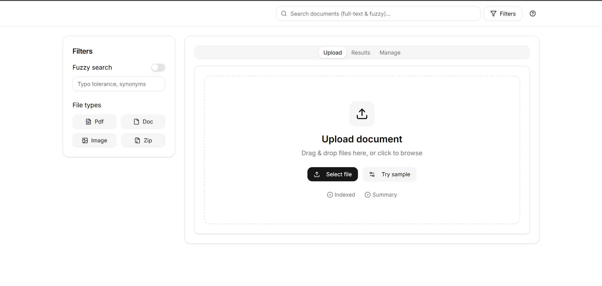
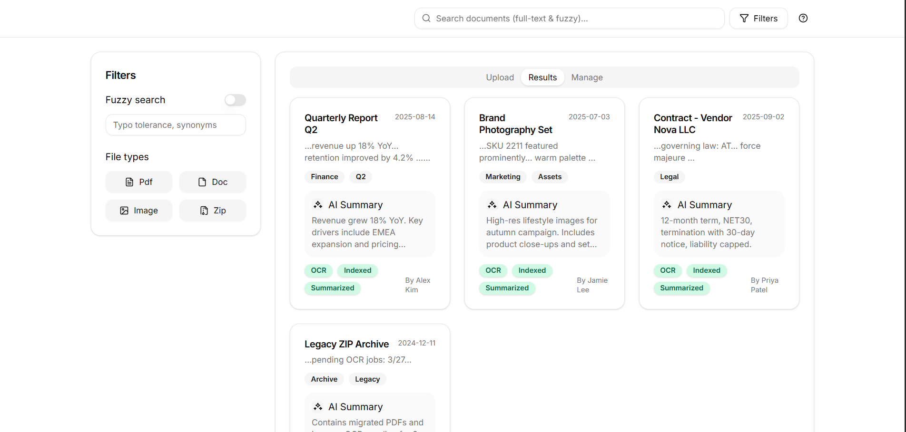

# Projekt-Dokumentation - DocumentManagementSystem

## Architektur-Entscheidungen

### Backend (.NET 8, ASP.NET Core)
- **.NET 8 & C#**: Moderne, performante Plattform mit guter Unterstützung für Web-APIs, Entity Framework und Docker. Team-Expertise vorhanden.
- **Code-First REST API**: Endpunkte werden im Team abgestimmt und direkt im Code definiert. Das ermöglicht schnelle Iteration und Anpassung.
- **Repository-Pattern & ORM (EF Core)**: Trennung von Business-Logik und Datenzugriff, bessere Testbarkeit und Wartbarkeit. PostgreSQL als DB wegen Stabilität und Open-Source.
- **Unit-Tests mit Mocking**: xUnit und Moq, produktive DB wird für Tests gemockt. So werden Seiteneffekte vermieden und die Funktionalität gesichert.
- **Containerisierung (docker-compose)**: Backend und Datenbank laufen als Container, Healthchecks und Umgebungsvariablen sind konfiguriert. Das Setup ist reproduzierbar und einfach zu deployen.

### Frontend (React, Web-UI)
- **React mit modernen Komponenten**: Flexibel, weit verbreitet, unterstützt schnelle UI-Entwicklung. Tailwind und Lucide-Icons sorgen für ein modernes, konsistentes Design.
- **nginx als Webserver**: Leichtgewichtig, performant, weit verbreitet. Trennung von Backend und UI ermöglicht unabhängige Entwicklung und Deployment.
- **Kommunikation per REST**: Die UI kommuniziert per HTTP mit dem REST-Server, API-Requests werden per Proxy weitergeleitet. Klare Trennung der Verantwortlichkeiten.
- **docker-compose für UI**: Die UI läuft als eigener Container, Compose-File enthält jetzt drei Services (DB, Backend, UI). Modular und skalierbar.

---

## UI-Konzept und Interaktionen (Sprint 2)

Das Interface des Dokumentenmanagement Systems bietet drei Kernfunktionen:

### 1. Upload
- **Dokument hochladen**: Drag & Drop oder Dateiauswahl, Metadaten (Titel, Beschreibung, Tags) werden erfasst.
- **Verarbeitung**: Nach Upload erscheinen automatisch eine Vorschau und eine AI-Zusammenfassung (folgt).
  

### 2. Results
- **Übersicht**: Alle Dokumente werden angezeigt, inkl. Name, Datum, Tags und AI-Zusammenfassung.
- **Suche**: Eingabe in die Suchleiste aktualisiert die Ansicht in Echtzeit.
- **Fuzzy-Toggle**: Erlaubt tolerante Suche (z.B. Tippfehler).
- **Filterfunktion**: Dokumenttypen können per Button ein-/ausgeblendet werden.

### 3. Manage
- **Dokumente suchen**: Suchfeld und Filter stehen zur Verfügung.
- **Actions**: Dokumente können gelöscht oder aktualisiert werden.

### Interaktionen
- **Suche**: Echtzeit-Filterung, Fuzzy-Toggle für Tippfehler-Toleranz.
- **Upload**: Klick auf „Select File“ lädt Beispiel-Dokument, nach Upload erscheinen Preview und Zusammenfassung.
- **Dokumentdetails**: Klick auf ein Ergebnis öffnet die Vorschau. Tabs innerhalb der Vorschau:
    - **Summary**: Editierbar.
    - **Metadaten**: Titel, Autor, Tags editierbar.
    - **Activity Log**: Upload-Datum, Indexierung.

---

## Queues, Worker & Logging (Sprint 3)

### Ziele
- Integration von RabbitMQ als Messaging-System.  
- API sendet OCR-Nachricht nach Upload.  
- OCR-Worker empfängt und loggt Nachrichten (Proof-of-Concept).  
- Logging & Fehlertoleranz sicherstellen.  
- Keine HTTP-500 bei Messaging-Fehlern.

---

## RabbitMQ-Integration – Technische Dokumentation

### Architekturüberblick
| Komponente | Rolle |
|-------------|-------|
| **Queue** | `ocr-queue` |
| **Publisher** | API (`DocumentsController → RabbitMqService`) |
| **Consumer** | OCR-Worker (Konsolen-App / Container) |
| **Infrastruktur** | `docker-compose.yml` enthält `rabbitmq:3-management` (Ports 5672, 15672) |

---

### Ablauf beim Upload (technisch)

1. **Client → API**  
   `POST /api/documents` (multipart/form-data) mit `file`, `title`, optional `description`, `tags`.

2. **Validierung**  
   `DocumentsController` prüft `ModelState` → bei Fehlern `400 ProblemDetails`.

3. **Business-Logik**  
   `DocumentService.CreateAsync`:
   - Prüft Titel, Tags.
   - Ruft `ITagRepository.GetOrCreateAsync` auf.
   - Erstellt neues `Document`-Entity.

4. **Persistenz (Datenbank)**  
   - `IDocumentRepository.AddAsync(doc)` → EF Core `SaveChangesAsync()`.  
   - Erfolgreiche Speicherung ist Voraussetzung für Queue-Publish.

5. **Datei speichern**  
   - Sicherer Name (`safeTitle_{DocumentId}.pdf`) in `files/` gespeichert.

6. **Nachricht in RabbitMQ senden**  
   - `RabbitMqService.SendOcrMessage(new { DocumentId, FileName })`.  
   - JSON serialisiert, `ocr-queue` deklariert, persistent publish.  
   - Publish-Fehler → **nur Log**, kein HTTP-Fehler.

7. **Worker (Consumer)**  
   - Liest `ocr-queue`.  
   - Loggt Payload, führt `BasicAck` aus.  
   - Proof-of-Concept (keine OCR-Verarbeitung in Sprint 3).  
   - Später: OCR, Textspeicherung, Folge-Nachrichten.

---

## Logging Levels
| Level           | Einsatz                                                |
| --------------- | ------------------------------------------------------ |
| **Information** | Erfolgreiche High-Level Events (Upload, Queue Publish) |
| **Debug**       | Interne Schritte, z. B. Tag-Auflösung                  |
| **Warning**     | Validierungswarnungen, Retry-Themen                    |
| **Error**       | Ausnahmefälle, Fehlersituationen                       |

---

## Erweiterungsidee

Automatisches Tagging mit GemAI
→ Nach OCR und Textanalyse werden Dokumente automatisch mit thematischen Tags versehen (z. B. „Rechnung“, „Vertrag“, „Personalakte“).

---

## Zusammenfassung

- Trennung von Backend und UI: Erhöht Flexibilität und Wartbarkeit.
- Containerisierung: Vereinfacht Setup, Testing und Deployment.
- Moderne UI-Technologien: Schnelle Entwicklung, gutes Nutzererlebnis.
- Interaktive, nutzerfreundliche Oberfläche: Alle Kernfunktionen sind intuitiv erreichbar.
- Asynchrone Verarbeitung (RabbitMQ): Grundlage für skalierbare AI- & OCR-Prozesse.
